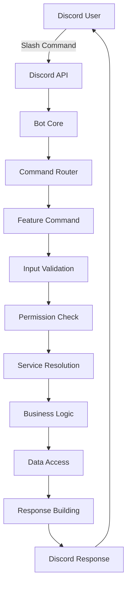
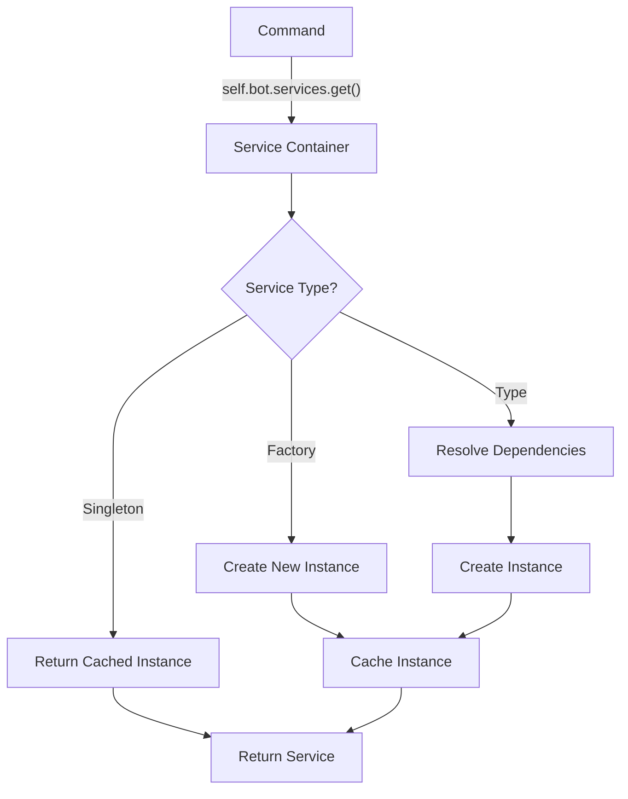
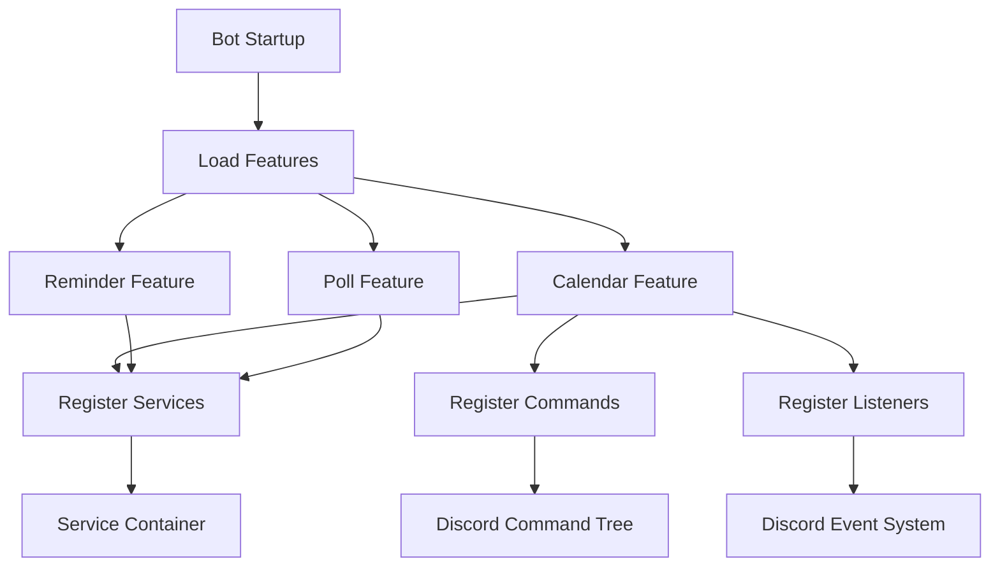

# **🏗️ System Design & Architecture**

This document provides a comprehensive overview of the Discord Bot's system architecture, design decisions, and implementation patterns.

---

## **📋 Table of Contents**

1. [Architecture Overview](#architecture-overview)
2. [Core Components](#core-components)
3. [Data Flow](#data-flow)
4. [Design Decisions](#design-decisions)
5. [Scalability Considerations](#scalability-considerations)
6. [Security Model](#security-model)
7. [Performance Characteristics](#performance-characteristics)

---

## **🏛️ Architecture Overview**

### **High-Level Architecture**

```
┌─────────────────────────────────────────────────────────────┐
│                        Discord API                          │
│                     (External Interface)                    │
└──────────────────────┬──────────────────────────────────────┘
                       │
┌─────────────────────────────────────────────────────────────┐
│                      Bot Core                               │
│  ┌─────────────────┐ ┌─────────────────┐ ┌─────────────────┐│
│  │  Event Handler  │ │ Command Router  │ │ Feature Manager ││
│  └─────────────────┘ └─────────────────┘ └─────────────────┘│
└──────────────────────┬──────────────────────────────────────┘
                       │
┌─────────────────────────────────────────────────────────────┐
│                 Service Container                           │
│              (Dependency Injection)                         │
└──────────────────────┬──────────────────────────────────────┘
                       │
┌─────────────────────────────────────────────────────────────┐
│                    Features Layer                           │
│ ┌──────────┐ ┌──────────┐ ┌──────────┐ ┌──────────────────┐ │
│ │ Calendar │ │ Reminder │ │  Polls   │ │ Users │ ... │Etc │ │
│ └──────────┘ └──────────┘ └──────────┘ └──────────────────┘ │
└──────────────────────┬──────────────────────────────────────┘
                       │
┌─────────────────────────────────────────────────────────────┐
│                   Services Layer                            │
│ ┌──────────────┐ ┌──────────────┐ ┌──────────────────────┐ │
│ │CalendarService│ │ReminderService│ │UserService │ ... │Etc│ │
│ └──────────────┘ └──────────────┘ └──────────────────────┘ │
└──────────────────────┬──────────────────────────────────────┘
                       │
┌─────────────────────────────────────────────────────────────┐
│                  Data Access Layer                          │
│ ┌──────────────┐ ┌──────────────┐ ┌──────────────────────┐ │
│ │   Database   │ │ Google APIs  │ │ External Services    │ │
│ │  (SQLAlchemy)│ │              │ │                      │ │
│ └──────────────┘ └──────────────┘ └──────────────────────┘ │
└─────────────────────────────────────────────────────────────┘
```

### **Architectural Principles**

1. **Separation of Concerns**: Each layer has distinct responsibilities
2. **Dependency Injection**: Loose coupling through service container
3. **Modular Design**: Features are independent and self-contained
4. **Single Responsibility**: Each component has one clear purpose
5. **Open/Closed Principle**: Easy to extend, difficult to break
6. **Interface Segregation**: Clean, focused interfaces

---

## **🔧 Core Components**

### **1. Bot Core (`src/core/bot.py`)**

**Purpose**: Central orchestrator and entry point for the bot.

**Responsibilities**:
- Initialize Discord client connection
- Bootstrap service container
- Load and register all features
- Handle global error conditions
- Manage bot lifecycle

**Key Interfaces**:
```python
class BotCore:
    def __init__(self)
    async def setup()           # Initialize all systems
    async def _load_features()  # Register features
    def run()                   # Start bot
```

### **2. Service Container (`src/core/service_container.py`)**

**Purpose**: Dependency injection container for managing service lifecycles.

**Capabilities**:
- **Singleton Management**: One instance per application
- **Factory Registration**: Create instances on demand
- **Type Resolution**: Automatic dependency resolution
- **Interface Binding**: Abstract to concrete mapping

**Design Pattern**: Dependency Injection Container
```python
# Registration
container.register_singleton("calendar_service", CalendarService())

# Resolution
service = container.get("calendar_service")
```

### **3. Base Feature (`src/core/base_feature.py`)**

**Purpose**: Abstract base for all bot features.

**Plugin Architecture**: Each feature is essentially a plugin that:
- Registers its services with the container
- Defines its Discord commands
- Sets up event listeners
- Provides feature-specific functionality

**Lifecycle**:
```python
async def register_services()   # Register DI services
async def register_commands()   # Register Discord commands
async def register_listeners()  # Register event handlers
```

### **4. Base Command (`src/core/base_command.py`)**

**Purpose**: Template Method pattern for consistent command execution.

**Execution Flow**:
```
User Input → Validation → Permission Check → Business Logic → Response → Cleanup
```

**Template Method Implementation**:
```python
async def execute(self, interaction, **kwargs):
    await self.pre_execute(interaction, **kwargs)
    if not await self._check_permissions(interaction):
        return await self._send_permission_error(interaction)

    validation_result = await self.validate_input(interaction, **kwargs)
    if not validation_result.get('valid', True):
        return await self._send_validation_error(interaction, validation_result)

    result = await self.process_command(interaction, validation_result)
    await self.send_response(interaction, result)
    await self.post_execute(interaction, result)
```

---

## **🔄 Data Flow**

### **Command Execution Flow**



### **Service Resolution Flow**



### **Feature Registration Flow**



---

## **🎯 Design Decisions**

### **1. Service Container vs. Direct Imports**

**Decision**: Use dependency injection container instead of direct service imports.

**Rationale**:
- **Testability**: Easy to mock services for unit testing
- **Flexibility**: Services can be swapped without code changes
- **Loose Coupling**: Components don't depend on concrete implementations
- **Lifecycle Management**: Centralized control over service creation and cleanup

**Trade-offs**:
- ✅ **Pro**: Better testability and flexibility
- ✅ **Pro**: Cleaner separation of concerns
- ❌ **Con**: Slight performance overhead
- ❌ **Con**: Runtime dependency resolution (less IDE support)

### **2. Feature-Based vs. Layer-Based Organization**

**Decision**: Organize code by features rather than technical layers.

**Structure**:
```
src/features/
├── calendar/
│   ├── commands/
│   ├── services/
│   └── models/
├── reminders/
│   ├── commands/
│   ├── services/
│   └── models/
```

**Rationale**:
- **Cohesion**: Related functionality grouped together
- **Team Development**: Teams can work on features independently
- **Business Alignment**: Code structure matches business domains
- **Easier Navigation**: Find feature-related code quickly

### **3. Template Method for Commands**

**Decision**: Use Template Method pattern for command execution.

**Benefits**:
- **Consistency**: All commands follow the same execution flow
- **Extensibility**: Easy to add new validation or error handling
- **Code Reuse**: Common functionality implemented once
- **Maintainability**: Changes to execution flow apply to all commands

### **4. Async/Await Throughout**

**Decision**: Use async/await for all I/O operations.

**Rationale**:
- **Performance**: Non-blocking I/O for better concurrency
- **Discord.py Compatibility**: Natural fit with Discord.py's async model
- **Future-Proofing**: Ready for high-concurrency scenarios
- **Consistent Model**: Single paradigm throughout the codebase

### **5. EmbedBuilder Pattern**

**Decision**: Use Builder pattern for Discord embeds.

**Benefits**:
- **Fluent Interface**: Readable, chainable API
- **Consistency**: Uniform styling across all responses
- **Reusability**: Common embed patterns abstracted
- **Maintainability**: Changes to styling apply globally

---

## **📈 Scalability Considerations**

### **Horizontal Scaling Challenges**

**Current Limitations**:
- **Single Instance**: Bot runs as single process
- **In-Memory State**: Service container state not shared
- **Database Connections**: Limited by connection pool

**Future Scaling Options**:

#### **1. Multi-Instance Deployment**
```python
# Load balancing considerations
class BotCluster:
    def __init__(self, instance_count: int):
        self.instances = [BotCore() for _ in range(instance_count)]

    async def distribute_load(self):
        # Guild-based sharding or command-based distribution
        pass
```

#### **2. Service Extraction**
```python
# Extract services to separate microservices
class RemoteCalendarService:
    def __init__(self, api_endpoint: str):
        self.endpoint = api_endpoint

    async def create_event(self, event_data):
        # HTTP call to calendar microservice
        pass
```

#### **3. Event-Driven Architecture**
```python
# Use message queues for feature communication
class EventBus:
    async def publish(self, event: str, data: dict):
        # Publish to message queue (Redis, RabbitMQ)
        pass

    async def subscribe(self, event: str, handler: Callable):
        # Subscribe to event stream
        pass
```

### **Database Scaling**

**Current Approach**: Single SQLAlchemy session per operation
**Scaling Strategy**:
- Read replicas for query operations
- Connection pooling optimization
- Query optimization and indexing
- Potential migration to NoSQL for specific use cases

### **Caching Strategy**

**Current State**: No caching layer
**Future Implementation**:
```python
class CachedCalendarService:
    def __init__(self, base_service: CalendarService, cache: Redis):
        self.service = base_service
        self.cache = cache

    async def get_calendar(self, name: str):
        # Check cache first, fallback to service
        cached = await self.cache.get(f"calendar:{name}")
        if cached:
            return json.loads(cached)

        result = await self.service.get_calendar(name)
        await self.cache.setex(f"calendar:{name}", 300, json.dumps(result))
        return result
```

---

## **🔒 Security Model**

### **Permission System**

**Three-Tier Security**:

1. **Discord Permissions**: Server-level role permissions
2. **Bot Permissions**: Application-level access control
3. **Feature Permissions**: Business logic access control

```python
class PermissionLevel(Enum):
    PUBLIC = "public"      # Anyone can use
    USER = "user"          # Must be in a guild
    ADMIN = "admin"        # Server administrator
    OWNER = "owner"        # Bot owner only
```

### **Input Validation**

**Multi-Layer Validation**:
1. **Type Validation**: Discord.py parameter types
2. **Business Validation**: Custom validation in commands
3. **Data Validation**: Service-level validation
4. **Database Constraints**: Final data integrity checks

### **Error Information Disclosure**

**Principle**: Never expose internal system details in user-facing errors.

```python
try:
    result = await database_operation()
except DatabaseError as e:
    # Log full error internally
    logger.error(f"Database error: {e}")

    # Return generic error to user
    return CommandResult(
        success=False,
        error="An error occurred. Please try again later."
    )
```

### **Rate Limiting**

**Current State**: Relies on Discord's built-in rate limiting
**Future Enhancement**:
```python
class RateLimiter:
    def __init__(self, requests_per_minute: int):
        self.limit = requests_per_minute
        self.requests = {}

    async def check_limit(self, user_id: int) -> bool:
        # Implement sliding window rate limiting
        pass
```

---

## **⚡ Performance Characteristics**

### **Response Time Targets**

- **Simple Commands** (help, status): < 500ms
- **Data Retrieval** (list calendars): < 1s
- **Complex Operations** (create event): < 2s
- **Long Operations** (visualization): < 5s

### **Memory Usage**

**Current Footprint**:
- **Base Bot**: ~50MB
- **Per Feature**: ~5-10MB
- **Service Container**: ~1-2MB
- **Command Cache**: ~5MB

**Optimization Strategies**:
- Lazy loading of heavy services
- Memory-efficient data structures
- Periodic garbage collection
- Connection pooling

### **Database Performance**

**Query Optimization**:
```sql
-- Indexed queries for common operations
CREATE INDEX idx_calendar_name ON calendars(name);
CREATE INDEX idx_user_reminders ON reminders(user_id, is_active);
CREATE INDEX idx_event_time ON events(start_time, end_time);
```

**Connection Management**:
```python
# Async connection pooling
engine = create_async_engine(
    DATABASE_URL,
    pool_size=20,
    max_overflow=30,
    pool_timeout=30,
    pool_recycle=3600
)
```

### **Monitoring and Metrics**

**Key Metrics to Track**:
- Command execution time
- Service resolution time
- Database query performance
- Memory usage patterns
- Error rates by feature

```python
class PerformanceMonitor:
    async def track_command_execution(self, command: str, duration: float):
        # Send metrics to monitoring system
        pass

    async def track_service_resolution(self, service: str, duration: float):
        # Track DI container performance
        pass
```

---

## **🔄 System Lifecycle**

### **Startup Sequence**

1. **Environment Setup**: Load configuration and secrets
2. **Service Container**: Initialize dependency injection
3. **Feature Loading**: Register all features and their services
4. **Command Registration**: Register Discord slash commands
5. **Event Listeners**: Set up Discord event handlers
6. **Discord Connection**: Connect to Discord API
7. **Command Sync**: Sync commands with Discord servers

### **Shutdown Sequence**

1. **Graceful Disconnect**: Close Discord connection
2. **Service Cleanup**: Dispose of services and resources
3. **Database Cleanup**: Close database connections
4. **Background Tasks**: Cancel scheduled reminders
5. **Resource Cleanup**: Free memory and file handles

### **Error Recovery**

**Automatic Recovery**:
- Database connection errors: Retry with exponential backoff
- Discord API errors: Respect rate limits and retry
- Service errors: Log and continue operation

**Manual Recovery**:
- Configuration errors: Require restart
- Critical service failures: Graceful degradation
- Memory exhaustion: Alert administrators

---

## **🎉 Summary**

The Discord Bot architecture provides:

### **Key Strengths**
- **Modular Design**: Features can be developed independently
- **Testable Architecture**: Comprehensive testing support
- **Extensible Framework**: Easy to add new features
- **Robust Error Handling**: Graceful failure management
- **Performance-Oriented**: Async throughout, optimized queries

### **Future Evolution**
- **Microservices Migration**: Extract services for scaling
- **Event-Driven Communication**: Decouple feature interactions
- **Advanced Caching**: Multi-tier caching strategy
- **Monitoring Integration**: Comprehensive observability
- **Horizontal Scaling**: Multi-instance deployment

This architecture provides a solid foundation for a production-ready Discord bot that can scale and evolve with changing requirements.