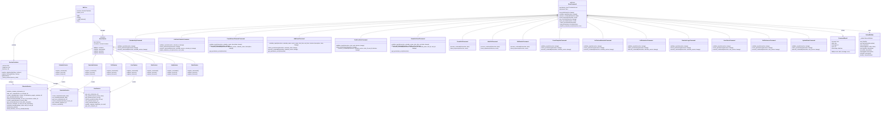

```mermaid
classDiagram
    %% Core Architecture
    class BotCore {
        +services: ServiceContainer
        +owner_id: int
        +__init__()
        +setup()
        +_load_features()
        +run()
    }

    class ServiceContainer {
        -_services: dict
        -_singletons: dict
        -_factories: dict
        +register_singleton(interface, instance)
        +register_factory(interface, factory)
        +get(interface) T
        -_create_instance(service_class)
    }

    %% Base Classes
    class BaseFeature {
        <<abstract>>
        +bot: BotCore
        +container: ServiceContainer
        +__init__(bot, container)
        +register_commands()*
        +register_services()*
        +register_listeners()*
    }

    class BaseCommand {
        <<abstract>>
        +permission_level: PermissionLevel
        +ephemeral: bool
        +execute(interaction, kwargs)
        +validate_input(interaction, kwargs)*
        +process_command(interaction, data)*
        +send_response(interaction, result)
        +pre_execute(interaction, kwargs)
        +post_execute(interaction, result)
        -_check_permissions(interaction)
        -_send_permission_error(interaction)
        -_handle_command_error(interaction, error)
    }

    %% Core Utilities
    class EmbedBuilder {
        -_embed: discord.Embed
        +set_title(title)
        +set_description(description)
        +set_color(color)
        +add_field(name, value, inline)
        +success(title, description)
        +error(title, description)
        +warning(title, description)
        +info(title, description)
        +build() discord.Embed
    }

    class CommandResult {
        +success: bool
        +data: Any
        +message: str
        +error: str
        +timestamp: datetime
        +__init__(success, data, message, error)
    }

    %% Features
    class CalendarFeature {
        +register_commands()
        +register_services()
        +register_listeners()
    }

    class ReminderFeature {
        +register_commands()
        +register_services()
        +register_listeners()
    }

    class PollFeature {
        +register_commands()
        +register_services()
        +register_listeners()
    }

    class UserFeature {
        +register_commands()
        +register_services()
        +register_listeners()
    }

    class RoleFeature {
        +register_commands()
        +register_services()
        +register_listeners()
    }

    class HelpFeature {
        +register_commands()
        +register_services()
        +register_listeners()
    }

    class StatsFeature {
        +register_commands()
        +register_services()
        +register_listeners()
    }

    %% Calendar Commands
    class CalendarHelpCommand {
        +validate_input(interaction, kwargs)
        +check_permissions(interaction, kwargs)
        +execute_command(interaction, calendar_service, kwargs)
    }

    class LinkUserCalendarCommand {
        +validate_input(interaction, calendar_id, kwargs)
        +check_permissions(interaction, kwargs)
        +execute_command(interaction, calendar_service, calendar_id, kwargs)
        +handle_validation_error(interaction, error_data)
    }

    class CreateSharedCalendarCommand {
        +validate_input(interaction, calendar_name, description, kwargs)
        +check_permissions(interaction, kwargs)
        +execute_command(interaction, calendar_service, calendar_name, description, kwargs)
        +get_permission_error(interaction)
    }

    class AddEventCommand {
        +validate_input(interaction, calendar_name, event_name, start_time, end_time, location, description, roles, kwargs)
        +check_permissions(interaction, calendar_name, kwargs)
        +execute_command(interaction, calendar_service, kwargs)
        +get_permission_error(interaction)
    }

    class FindFreeSlotsCommand {
        +validate_input(interaction, start, end, duration, kwargs)
        +check_permissions(interaction, kwargs)
        +execute_command(interaction, calendar_service, start_dt, end_dt, duration, kwargs)
    }

    class VisualizePeriodCommand {
        +validate_input(interaction, calendar_name, start_date, end_date, kwargs)
        +check_permissions(interaction, calendar_name, kwargs)
        +execute_command(interaction, calendar_service, calendar_name, start_dt, end_dt, kwargs)
        +get_permission_error(interaction)
    }

    %% Poll Commands
    class CreatePollCommand {
        +process_command(interaction, data)
        +send_response(interaction, result)
    }

    class VotePollCommand {
        +process_command(interaction, data)
        +send_response(interaction, result)
    }

    class PollResultsCommand {
        +process_command(interaction, data)
        +send_response(interaction, result)
    }

    %% Reminder Commands
    class CreateTemplateCommand {
        +validate_input(interaction, kwargs)
        +check_permissions(interaction, kwargs)
        +execute_command(interaction, reminder_service, kwargs)
    }

    class SetCustomReminderCommand {
        +validate_input(interaction, kwargs)
        +check_permissions(interaction, kwargs)
        +execute_command(interaction, reminder_service, kwargs)
    }

    class ListRemindersCommand {
        +validate_input(interaction, kwargs)
        +check_permissions(interaction, kwargs)
        +execute_command(interaction, reminder_service, kwargs)
    }

    class ReminderLogsCommand {
        +validate_input(interaction, kwargs)
        +check_permissions(interaction, kwargs)
        +execute_command(interaction, reminder_service, kwargs)
    }

    %% User Commands
    class UserStatusCommand {
        +validate_input(interaction, kwargs)
        +check_permissions(interaction, kwargs)
        +execute_command(interaction, user_service, kwargs)
    }

    class SetPreferenceCommand {
        +validate_input(interaction, kwargs)
        +check_permissions(interaction, kwargs)
        +execute_command(interaction, user_service, kwargs)
    }

    class UpdateRolesCommand {
        +validate_input(interaction, kwargs)
        +check_permissions(interaction, kwargs)
        +execute_command(interaction, user_service, kwargs)
    }

    %% Services
    class CalendarService {
        +validate_calendar_id(calendar_id)
        +link_user_calendar(user_id, calendar_id)
        +create_calendar(name, creator_id, description, google_calendar_id)
        +get_calendar(calendar_name)
        +add_permission(calendar_id, user_id, permission, admin_id)
        +create_event(calendar_id, event_data)
        +get_events(calendar_id, start_date, end_date)
        +find_free_slots(user_id, start_dt, end_dt, duration)
        +visualize_period(calendar_name, start_dt, end_dt)
        +build_help_embed()
        +build_calendar_success_embed(calendar)
    }

    class ReminderService {
        +create_template(template_data)
        +set_reminder(reminder_data)
        +get_user_reminders(user_id)
        +cancel_reminder(reminder_id, user_id)
        +get_reminder_logs(user_id)
        +execute_reminders()
    }

    class UserService {
        +get_user_status(user_id)
        +set_preference(user_id, key, value)
        +get_preference(user_id, key)
        +remove_preference(user_id, key)
        +list_preferences(user_id)
        +clear_preferences(user_id)
        +update_calendar_email(user_id, email)
        +get_user_info(user_id)
    }

    %% Relationships
    BotCore --> ServiceContainer : contains
    BotCore --> BaseFeature : manages
    
    BaseFeature <|-- CalendarFeature
    BaseFeature <|-- ReminderFeature
    BaseFeature <|-- PollFeature
    BaseFeature <|-- UserFeature
    BaseFeature <|-- RoleFeature
    BaseFeature <|-- HelpFeature
    BaseFeature <|-- StatsFeature

    BaseCommand <|-- CalendarHelpCommand
    BaseCommand <|-- LinkUserCalendarCommand
    BaseCommand <|-- CreateSharedCalendarCommand
    BaseCommand <|-- AddEventCommand
    BaseCommand <|-- FindFreeSlotsCommand
    BaseCommand <|-- VisualizePeriodCommand
    BaseCommand <|-- CreatePollCommand
    BaseCommand <|-- VotePollCommand
    BaseCommand <|-- PollResultsCommand
    BaseCommand <|-- CreateTemplateCommand
    BaseCommand <|-- SetCustomReminderCommand
    BaseCommand <|-- ListRemindersCommand
    BaseCommand <|-- ReminderLogsCommand
    BaseCommand <|-- UserStatusCommand
    BaseCommand <|-- SetPreferenceCommand
    BaseCommand <|-- UpdateRolesCommand

    CalendarFeature --> CalendarService : creates
    ReminderFeature --> ReminderService : creates
    UserFeature --> UserService : creates

    BaseCommand --> CommandResult : returns
    BaseCommand --> EmbedBuilder : uses

    ServiceContainer --> CalendarService : manages
    ServiceContainer --> ReminderService : manages
    ServiceContainer --> UserService : manages
```